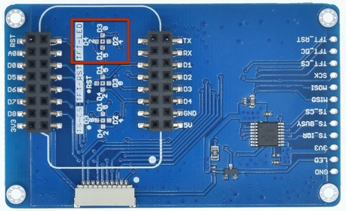
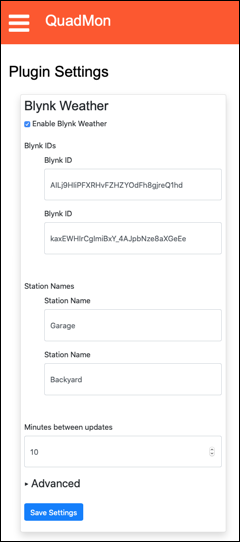

# MultiMon - Monitor Multiple 3D Printers

  

___

**NOTE**: This project is in its infancy and is a work-in-progress. Consider all releases to be pre-releases until this note goes away.
___

This project lets you monitor the activity of up to four 3D Printers which are being controlled with either [OctoPrint](https://octoprint.org) or [Duet3D RepRap software](https://duet3d.dozuki.com/Wiki/Firmware_Overview). The monitor has a Web UI for configuration and a GUI displayed on a color touch screen. In addition to displaying printer status, it can also display weather information. The code is structured so that it is relatively straightforward to add new screens (information pages) with other types of information.

For details on using the device, please see the [*MultiMon* GUI documentation](doc/MultiMonGUI.md).

*MultiMon* uses the [WebThing](https://github.com/jpasqua/WebThing) framework and is configured using a web-based UI where the user specifies information such as:  

* The server information for your printers
* API keys for underlying services (like OpenWeatherMap and TimezoneDB)
* Configuration information for the built-in web server
* etc.

Some of this configuration information is specific to *MultiMon* while other information is common to any web-connected device. You can learn more about such *WebThing*s [here](https://github.com/jpasqua/WebThing).

## Dependencies

### Libraries
The following third party libraries are used within this project. You'll need to download them and place them in your Arduino `library` folder before you build the project.

* [Arduino-Log](https://github.com/thijse/Arduino-Log)
* [ArduinoJson](https://github.com/bblanchon/ArduinoJson): Minimum version: 6.15
* [ESPTemplateProcessor](https://github.com/jpasqua/ESPTemplateProcessor)
* [TFT\_eSPI](https://github.com/Bodmer/TFT_eSPI): Minimum version 2.2.7
* [TimeLib](https://github.com/PaulStoffregen/Time.git)
* [JSONService](https://github.com/jpasqua/JSONService)
* [WebThing](https://github.com/jpasqua/WebThing)
* [WiFiManager](https://github.com/tzapu/WiFiManager)

The following libraries are used in the browser. you do not need to download or install them. They are listed here because if you are doing further development of the broser code, you may need to understand their usage:

* [JSON Form](https://github.com/jsonform/jsonform)

### Services
The following services play a role in providing parts of the functionality. You will need to obtain a free API key for each using the provided links:

 - [OpenWeatherMap.org](https://openweathermap.org/appid): Provides weather data for your city.
 - Services used by [WebThing](https://github.com/jpasqua/WebThing)
	 - [Google Maps](https://developers.google.com/maps/documentation): Used for geocoding and reverse geocoding. Though not absolutely necessary, it does make using the system a bit more convenient. *Note* that this functionality is only used by the client code - not code running on the device.
	 - [TimeZoneDB](https://timezonedb.com): Used to get local time and time zone data. This is used to timestamp data.

<a name="organization"></a>
## Organization

### Directory Structure
The directory structure of the project is shown below. You don't need to know this to build and use the project, but if you want to work on it, this will give you an idea of where everything is located.

````
    MultiMon
        [Primary Source files including MultiMon.ino]
        /data
            [HTML page templates for MultiMon]
            /plugins
                [See PluginGuide.md]
            /wt
                [HTML page templates for WebThing]
        /doc
            MultiMonGUI.md
            PluginGuide.md
            /images
        /resources
            /TFT_eSPI
                [Sample User Setups for TFT_eSPI]
        /src
            /clients
                [Printer and Weather Clients]
            /gui
                [Implementation of all of the Screens]
                /fonts
                    [Custom fonts]
                /images
                    [Custom images]
            /plugins
                [See PluginGuide.md]

````

### Code Structure

The primary functional areas of *MultiMon* are given below. You don't need to know this to build and use the project, but if you want to work on it, this will give you an idea of where the different functionality is implemented.

* `MultiMon`
	* The primary logic for the application. It holds the printer client objects and the settings object which are used throughout the application. `MultiMon` uses the `WebThing` framework and follows the organization it defines for the setup and loop functions.
	* `MultiMon` calls the `GUI` as part of its main loop to give it time to execute.
* `MMSettings`
	* Provides the functionality to read, write, and update settings that are shared throughout the application.
* `MMWebUI`
	* Implements the Web UI for *MultiMon* which primarily consists of pages that allow the user to view and update the settings of the device. When settings change in the Web UI, it calls back into the core of the code to have those changes reflected. 
	* **NOTE**: Currently the real-time handling of changes is not very thorough. Many changes require a reboot to take effect.
* `GUI` + `Screen`
	* `GUI` is the primary interface used to cause `Screens` to be displayed and updated, and for user input to be processed.
	* The heavy lifting for this is done by specialized implementations of the `Screen` class. There is a `TimeScreen`, a `WeatherScreen`, a `DetailScreen` and so on.
	* Each screen is responsible for:
		* Displaying itself using the `TFT_eSPI` library.
		* Updating itself if information changes. To avoid flickering, there is extensive use of the `TFT_eSPI` sprite capabilities.
		* Accepting and acting on user input in the form of presses on different areas of the screen which it has defined as buttons.
* `clients`
	* Client code to access OctoPrint, the Duet3D service, OpenWeatherMap, and anything specific to a plugin.  

<a name="building-multimon"></a>
## Building MultiMon

*MultiMon* has been built and tested with Arduino IDE 1.8.10 and ESP8266 cores 2.6.1 and 2.7.1. Newer versions are likely to work, but I haven't tried other specific combinations. If you have never built an Arduino project using an ESP8266, you'll need to [prepare your development environment](https://github.com/esp8266/Arduino#installing-with-boards-manager). 

<a name="hardware"></a>
### Hardware

This project requires an ESP8266 and a 320x240 touch screen display. It has been tested with a [Wemos D1 Mini](https://docs.wemos.cc/en/latest/d1/d1_mini.html) and a [Wemos D1 Mini 2.4" TFT Shield](https://docs.wemos.cc/en/latest/d1_mini_shiled/tft_2_4.html). They are a nice combination since they require no soldering and only 1 mounting point (the display). However, it should work with virtually any ESP8266 with sufficient storage space and any 320x240 screen with an ILI9341 display controller and an XPT2046 touch screen controller.

If you'd like a larger display, *MultiMon* has also been tested with the 2.8" and 3.2" variants of [this one](https://www.aliexpress.com/item/32960934541.html). Both versions of this display have a single 14-pin header that can be conveniently attached to the D1 Mini using this [adapter board](https://oshpark.com/shared_projects/IhMOtfQC).


I started by using this [board](https://oshpark.com/shared_projects/dopTFnBT), but it required that a trace be cut and re-routed to control the display brightness so I created the other.

#### Configuring the `TFT_eSPI` library for your display

`TFT_eSPI` needs to know how your display is connected to your ESP8266 including which pins are used for which signals. If you use the D1 Mini and D1 Mini TFT Shield, you can use the HW configuration supplied by this project (see below). There is also a configuration for the 2.8"/3.2" display with daughter board mentioned above.

If you use a different display, please refer to the [`TFT_eSPI`](https://github.com/Bodmer/TFT_eSPI) documentation. The library itself provides many configurations you can choose from, or you can create your own custom configuration.

To configure for the D1 Mini TFT Shield or the other display mentioned above, just copy the files listed below into the `TFT_eSPI` directory and uncomment the corresponding line in `User_Setup_Select.h`. By default it assumes the 2.4" TFT Shield.

* `MultiMon/resources/TFT_eSPI/User_Setup_Select.h` &rarr; `library/TFT_eSPI` 
	+ *Note*: This will overwrite the file in the destination, so you may wish to save the original.
* `MultiMon/resources/TFT_eSPI/User_Setups/D1Mini_ILI9341.h`  &rarr; `library/TFT_eSPI/User_Setups/D1Mini_ILI9341.h`
* `MultiMon/resources/TFT_eSPI/User_Setups/D1_DB_Mini_ILI9341.h`  &rarr; `library/TFT_eSPI/User_Setups/D1_DB_Mini_ILI9341.h`


#### Enabling brightness control

Many displays allow you to control their brightness. *MultiMon* takes advantage of this by providing an analog output which is proportional to the desired display brightness. The output pin to be used is specified in the `TFT_eSPI` configuration file and is named TFT_LED. 

Identify the input on your display which controls brightness, and connect the specified pin to it. This is particularly easy for the D1 Mini and TFT Shield. As shown in the images below, it provides a spot to make a solder bridge that connects the brightness input to pin D4 of the D1 Mini.

The first image shows the back side of the TFT Shield and the jumper area is marked in red.


In this image you can see the area in red from the previous image with the solder bridge applied.


<a name="enclosure"></a>
### Enclosure
You may use any housing you wish for *MultiMon*. I've uploaded two models to [thingiverse](thingiverse.com) that may be useful for the D1 Mini Shield hardware:

1. [2.4" TFT Modular Enclosure](https://www.thingiverse.com/thing:4393857)  
2. [Slanted box for 2.4Inch TFT](https://www.thingiverse.com/thing:4413894)

I have also upload [another model](https://www.thingiverse.com/thing:4460344) for use with a 3.2" display.


<a name="software"></a>
### Software
Building the software for *MultiMon* is a bit more complex than a typical application because it stores files on the ESP8266 file system. This means that you need to use a plug-in to the Arduino IDE to upload those files to the Arduino. The file structure is described in detail in the [*WebThing*](https://github.com/jpasqua/WebThing) readme file. In this section I will describe the steps involved.

1. Download and install the [`ESP8266 Sketch Data Upload`](https://github.com/esp8266/arduino-esp8266fs-plugin) plug-in. Note that installing this plugin is not the same as installing a normal Arduino library. Follow the installation instructions [here](https://github.com/esp8266/arduino-esp8266fs-plugin#installation). If you have installed successfully, you will see a new menu item in the Arduino IDE Tools menu. See the screen shot below.
2. Copy or link the `wt` directory from [*WebThing*](https://github.com/jpasqua/WebThing) `data` directory to the *MultiMon* `data` directory. When you're done you'll have a `data` directory that contains a number of `HTML` files and a `wt` subdirectory. The `wt` subdirectory will also contain `HTML` files.
3. You need to reserve some flash memory space for the file system. In the Tools menu of the Arduino IDE you will see a `Flash Size` submenu. Choose `FS: 1MB`.
4. Now connect your ESP8266 to your computer via USB and select the `ESP8266 Sketch Data Upload` item from the tools menu. You will see all the files in your `data` directory, including those in the `wt` subdirectory being loaded onto your ESP8266.
5. Finally you can proceed as usual and compile / upload *MultiMon* to your ESP8266.


<a name="preparation"></a>
## Preparation

Before you get started, you will need API keys for the services mentioned above (Google Maps, TimezoneDB, and OpenWeatherMap). All are free. Please go to each site, create a key, and keep track of them. You'll need to supply them during the configuration process. You'll also need the Octoprint API key for each of your OctoPrint-based printers. You can get those now or when you are [configuring your printers](#configure-printers).


<a name="connecting-to-your-network"></a>
## Connecting to your network

Once you have assembled your hardware and loaded the firmware, *MultiMon* will boot and create its own WiFi access point. Connect to the new access point you will see on your phone or computer's wifi connection list. It will have an SSID of the form `MM-nnnnnn`. Once you do, you will enter a "captive portal" where you can configure *MultiMon* to use your actual WiFi base station. When you've done that, *MultiMon* will restart and connect to your WiFi base station.

At this point you will need to connect to *MultiMon* using a web browser to configure your printers and other settings. You can connect using either an IP address or a hostname. You can find the IP address and the default host name on the Info Screen. To get to the info screen press and hold the clock area on the display for 1 second. See the [GUI documentation](/doc/MultiMonGUI.md) for details. 

Once you have connected to *MultiMon* with your browser, you'll need to configure your printers, set your OpenWeatherMap key, and customize your display. The [Configuring MultiMon](#configuring-multimon) section provides details.

<a name="configuring-multimon"></a>
## Configuring MultiMon

Once connected, you can use the web interface to configure and change settings regarding your printers, how information is displayed, the weather configuration, and more. You get to the settings by selecting an item from the [hamburger menu](https://en.wikipedia.org/wiki/Hamburger_button) in the top left of the web page. The image in the [Home Page](#home-page) section illustrates the overall structure of all of the pages. Before getting to settings that are specific to *MultiMon*, you need to configure some general information for your web-connected device including a username / password. You do this using the [General Settings](#general-settings) menu item.

**Note**: If you have mounted your display in an enclosure in a way that is upside-down relative to the default configuration, you're image will be upside down until you get around to the [Configure Display](#configure-display) menu. This isn't a problem since the configuration will be happening in the Web UI, not on the display, but if it bothers you, you can skip to that step to flip the display orientation and then come back here.

<a name="general-settings"></a>
  
These settings are common to many network connected devices and are encapsulated by the [*WebThing*](https://github.com/jpasqua/WebThing) library. The settings you must configure are listed below in the order you will want to enter them on a new device. In general, once you have entered the General Settings once, you won't need to change them again. When you are setting up your device for the first time, you will need to enter some of the settings, save, and reboot before you can enter the rest. In particular, you'll need to enter the API keys before you can geolocate your address.

* API Keys: You need these keys to be entered in order to use the location options below and to have the time set.
	* [Google Maps](https://developers.google.com/maps/documentation/javascript/get-api-key): Fill in the api key you acquired from for the Google Maps service
	* [TimeZoneDB](https://timezonedb.com/api): Fill in the api key you acquired from for the TimezoneDB service. Note: NTP is perhaps a more natural choice for a time service, but it does not incorporate a mechanism for time zone determination. TimeZoneDB allows WebThing to get the time, time zone, and local time without need for another mechanism. **Note** that these keys will not be active until after you have saved them and rebooted the device.
* Username / Password: The username / password you'll use when you connect to *MultiMon*. This is not the same as any username/password you use to log into your printers. It defaults to admin/password. ***You should change these*** the first time you configure *MultiMon*.
* Web Server Settings:
	* Hostname: A network name for your *MultiMon* device. If you configure a name such as `MyMonitor`, then you can access your device from a browser using the address `http://MyMonitor.local` rather than using the IP address. This only works on systems that have support for mDNS. This is native on Macs but can be added to Linux and Windows with software such as [Avahi](https://github.com/lathiat/avahi).
	* Port: The port that *multiMon* will listen on. Usually 80 unless you've got a good reason.
* Location Settings: For *MultiMon* the location settings are used to determine the proper time zone. The city for which weather is shown may be anywhere and is not required to be the same location as you enter here.
	* Latitude, Longitude, Elevation: In *MultiMon*, these are only used to determine your time zone (for this purpose elevation is not important).
	* Address / Geocode: Since you probably don't know your lat/lon and elevation, enter an address in the Address field and press the Geocode button. Assuming you have already saved your Google Maps API key, the address will be translated to lat/lon and elevation. If you prefer not to create a Google Maps key, you can find your lat/lon manually as [described here](https://support.google.com/maps/answer/18539?co=GENIE.Platform%3DDesktop&hl=en).
* Theme Color: Choose a theme for the Web UI that suits your style. The themes are all from the [W3.CSS](https://www.w3schools.com/w3css/w3css_color_themes.asp) set.
* Indicator LED: Ignore this section. The Indicator LED functionality is not used by *MultiMon*.

<a name="configure-printers"></a>
  
Use this menu item to configure up to four printers. To start you will see four buttons - one for each printer. If you click one of these buttons, the area will expand to show the settings for that printer. Each printer may be set as OctoPrint or Duet3d depending on the type of controller. The specific settings are described below:

* Active: Check this box if this printer is to be monitored. Only leave it unchecked if you are monitoring less than 4 printers.
* Nickname: A short name for the printer that will be used in the GUI. It does not need to be related to the OctoPrint or Duet3D host name. It can be anything. It could be "Frank".
* Server: Server refers to the name/IP address of the OctoPrint or Duet3D server. Note that while you may use `mDNS` (Bonjour) names such as `foo.local`, I have found the reliability of name lookups to be spotty.
* Port: The port on which the print service is available (usually 80 for local printers).
* Printer Type: OctoPrint or Duet3D.
* User: Only displayed/required for OctoPrint printers. The username for OctoPrint.
* Password: The password for your OctoPrint / Duet3D server. For Duet3D, only enter this value if you have changed it from the default.
* API Key: Only displayed/required for OctoPrint printers. Get this from your OctoPrint server as described [here](https://octoclient.zendesk.com/hc/en-us/articles/360007208474-Where-to-Find-the-API-Key).

In addition to configuring each printer, you can set the refresh interval (in seconds) for all printers. For any printer that is actively printing, *MultiMon* will ask the printer for its status every time that interval elapses. By default, it is 30 seconds.

<a name="configure-display"></a>
  
Use this menu to configure aspects of the GUI - both how information is displayed and control of the display hardware. *MultiMon* will operate with defaults for these settings, but your display may be upside down! The specific settings are described below:

* Enable Schedules: You can set morning/evening schedules that control the brightness of the display.
	* To enable the schedules, click the checkbox.
	* Next, fill in the time at which Morning and Evening begin using the format HH:MM in 24 hour format. That is, 10:30PM would be 22:30.
	* Finally, fill in the brightness (between 1 and 100) for the display for Morning and Evening.
	* Note that the scheduled brightness can be overridden at any time from the [home page](#home-page) or from the GUI.
- Use 24 Hour Clock: Controls the display format of times in the GUI (10:30PM vs 22:30)
- Flip display orientation: Depending on how your hardware was mounted, your display may have been installed "upside down". If you see the image inverted, check this box.

<a name="weather-settings"></a>
  
Use this menu item to configure weather settings. Data for current weather conditions and the forecast are provided by OpenWeatherMap.org. If you are not interested in having the weather data or getting a key from OpenWeatherMap.org, you can disable this functionality. Simply uncheck the box labeled "Get Weather Data from OpenWeatherMap.org".

The rest of the settings are as follows:

- OpenWeatherMap API Key: The key you acquired for the OpenWeatherMap service
- City ID: OpenWeatherMaps identifies cities with a numeric code. Enter the code for your city. You can obtain the code [here](https://openweathermap.org/find).
- Weather Language: Language used for weather descriptions (e.g. Clouds, Mist, Rain)
- Use Metric: Use metric or imperial units in the interface

<a name="configure-plugins"></a>
  
Use this menu item to configure the settings for any loaded plugins. The settings will vary completely depending on the type of plugin. You must be asked to configure things like API keys, refresh times, or names of devices. Each configured plugin will have a separate section on the page with its own "Save" button. Hitting save will save the settings, but not leave the page as you may have other changes you'd like to make. An example of a plugin configuration page is shown below.




<a name="home-page"></a>
## Home Page

The home page for *MultiMon* (see below for screen shot) contains three primary elements.

1. **Printers**: A link to each configured printer. If a printer is marked as inactive (i.e. not monitored by *MultiMon*), it won't be listed here. Clicking any of these links will take you to the OctoPrint page or the DWC page for that printer.
2. **Display Brightness**: A brightness slider that reflects the brightness of *MultiMon*'s display when the page was loaded. You can move the slider and click the `Set Brightness` button to change the screen brightness. That level will stay in effect until you change it again, a [schedule is executed](#configure-display), or *MultiMon* is rebooted.
3. **Forecast**: An OpenWeatherMap banner with the 5-day forecast for the [configured weather city](weather-settings).


<a name="dev-info"></a>
## Operational Info for Developers

Though it is not normally part of the main menu, you can get to an additional page of options by entering the url `http://[MultiMon_Address]/dev` into your browser. If you wish, you can make it part of the main menu by going to `http://[MM_Address]/dev/enableDevMenu?showDevMenu=on`. Behind the scenes this has the effect of adding this line to the settings:

````
...
  "showDevMenu": true,
...
````  
You can disable the dev menu using `http://[MM_Address]/dev/enableDevMenu`.

### Mock (Simulated) Printer Operation

The `/dev` page allows you to make any one of the printers a "mock" printer meaning that it will produce artificial values that mimic what a real printer might produce. This can be useful for testing, debugging, and tuning the GUI or WebUI. To make any of the configured printers act as a mock printer, just check the associated box and then `Save`. These settings will not take effect until the next time *MultiMon* boots.

<a name="get-settings"></a>
**Viewing your settings**

It can sometimes be useful to see all the settings in their JSON representation. The `/dev` page has a `View Settings` button which will return a page with the JSON representation of the settings. You can also get to this page directly with the url `http://[MultiMon_Adress]/dev/settings`. If you save these settings as a file named `settings.json` and place it in your `data` directory, it can be uploaded to your device using `ESP8266 Sketch Data Uploader`. There is no need to do this, but developers may find it useful to easily switch between batches of settings.

The `/dev` page also has a `View WebThing Settings` button which will return a page with the JSON representation of the WebThing settings. This includes things such as the hostname, API keys, and the web color scheme.

**Screenshots**

Similarly you can get a screen shot of whatever is currently displayed on the device using the `Take a screen shot` button. This will display an image in your browser which corresponds to the current content of the display. You can also get to this page directly with the url `http://[MultiMon_Adress]/dev/screenShot`.

**Rebooting**

Finally, the `/dev` page also has a `Request Reboot` button. If you press the button you will be presented with a popup in your browser asking if you are sure. If you confirm, *MultiMon* will go to a "Reboot Screen" that displays a red reboot button and a green cancel button. The user must press and hold the reboot button for 1 second to confirm a reboot. Pressing cancel will resume normal operation. Pressing no button for 1 minute will behave as if the cancel button was pressed.

## Adding Screens
To add a news Screen, you need to implement a new subclass of Screen that knows how to display itself (using the [TFT\_eSPI](https://github.com/Bodmer/TFT_eSPI) library), and how to update itself on a periodic basis if the data it displays changes. The screen must also implement at least minimal navigation capability (i.e. a tap that takes the user to the next screen or back to the home screen). Look at some of the existing screens for examples.

If you'd rather not deal with the graphics library yourself, you can create screens without code using the [plugin](#dev-exp) mechanism described below.

**Implementation Note**: For a fairly [convoluted set of reasons](https://github.com/Bodmer/TFT_eSPI/issues/664), *MultiMon* has a wrapper for the `TFT_eSPI::setFreeFont` function. Though you can call `setFreeFont` directly, it will result in the code size growing significantly. As a result, you should use the wrapper functions (`GUI::Font:setUsingID`).

<a name="dev-exp"></a>
## Plugins

**MultiMon** has he beginnings of a plugin system which allows developers to expand or customize the functionality with little or no code. Please refer to the [Plugin Guide](doc/PluginGuide.md) for details.


## Acknowledgements

*MultiMon* was inspired by [Qrome](https://github.com/Qrome)'s great [Octoprint Printer Monitor](https://github.com/Qrome/printer-monitor). You'll will recognize, for example, that the Web UI looks very similar. It should since I followed Qrome's model but took a different implementation path.