# MultiMon GUI

## Overview

MultiMon is designed to monitor up to four printers which are driven by either [OctoPrint](http://octoprint.org) or [Duet3D RepRap software](https://duet3d.dozuki.com/Wiki/Firmware_Overview). The monitor has both a GUI and a Web UI displayed on a color touch screen. The Web UI is primarily for configuration.

The GUI is organized around the concept of "Screens" of information that are navigated using touches. Touches can either be a press or a long press and typically result in moving to another screen. they may also cause an action to occur, but remain on the current screen.

MultiMon regularly calls out to the printers to get their status. If a printer is offline, MultiMon checks it every 5-10 minutes to see if it has come back online. If a printer is online, but not printing, MultiMon checks it every 1-3 minutes to see if it has changed. If a printer is actually in the process of printing, MultiMon updates its status every 10 seconds. You can force a refresh sooner using either the Web UI or the [GUI](#info-screen).

These calls can take a second or two depending  on how many printers are being checked and how responsive they are. During these periods the GUI is not responsive. To let the user know when this is happening, the GUI overlays a small info icon in the upper right hand corner of the screen. It is automatically removed when the calls are complete. When the info icon has a green border it means that MultiMon is talking to a printer. When it has an orange border it means that MultiMon is getting weather information.

*Note: The screen shots below are image captures from the device.*

## Screens

Index of Screens (alphabetical):

* [Calibration Screen](#calibration-screen)
* [Config Screen](#config-screen)
* [Info Screen](#info-screen)
* [Forecast Screen](#forecast-screen)
* [Printer Status Screen](#printer-status-screen)
* [Printer Detail Screen](#printer-detail-screen)
* [Reboot Screen](#reboot-screen)
* [Splash Screen](#splash-screen)
* [Time Screen (aka Home Screen)](#time-screen)
* [Weather Screen](#weather-screen)
* [Wifi Screen](#wifi-screen)

### WiFi Screen

When MultiMon boots, the first thing it displays is the WiFi Screen. This will remain on the screen until a WiFi connection is established. Once the unit is connected to your WiFi network, the display will automatically navigate to the [Splash Screen](#splash-screen).

**Actions**:

* If MultiMon cannot connect to your WiFi network (e.g. it is new and hasn't been configured yet), it will automatically navigate to the [Config Screen](#config-screen).
* There are no actions available to the user.

### Splash Screen

The Splash Screen is displayed during the boot process while MultiMon is initializing. You will notice that the Info Icon is displayed almost the whole time since MultiMon is getting initial status from all configured printers, getting the current weather, and getting the forecast.

In the screen shots below you will see the info icon displayed in the upper right corner. A green border indicates that it is receiving printer status, while an orange border means it is getting weather data.

**Actions**:

* There are no actions available to the user. Once initialization is complete, MultiMon will automatically display the [Home Screen](#home-screen).

### Time Screen (aka Home Screen)

The time screen is the the primary/home screen. It provides a clock, overview status of the printers, and a single line of weather information. The screen shots below capture the home screen in a variety of situations. The elements of the scree are as follows:

* The current temperature and weather description for the selected city
* The next line shows the expected completion time of the next print across all configured printers. If there is no print in progress, then that line will not be displayed.
* The largest area shows the time. The format (24 hour or AM/PM) is configured in the Web UI.
* Across the bottom of the home screen are status indicators for each printer. To conserve space, this screen does not show the printer nicknames. The printers are displayed in the order in which they were configured in the Web UI. Each status indicator will show the current state which can be:
	* **Offline**: No connection to the printer
	* **Online**: Connected to the printer, but no print in progress
	* **Printing**: In which case the area displays a progress bar with percent complete
	* **Unused**: Meaning that printer has not been configured

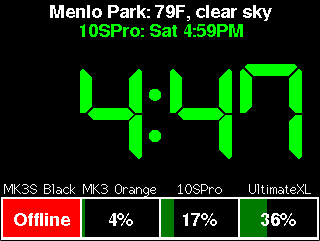
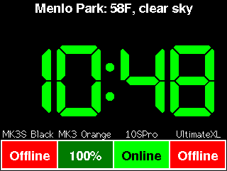
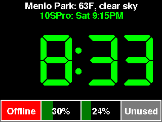
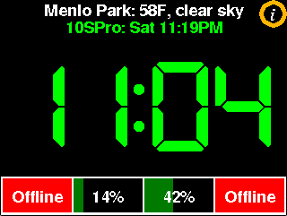
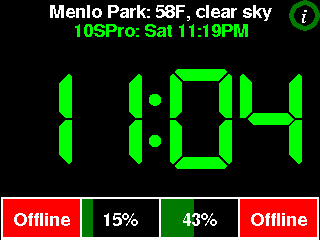

**Actions**:

* Pressing anywhere within the weather area navigates to the Weather Screen. Note that since this area is not very tall, the actual sensitivity area extends below the weather line to make it easier to press with a finger (rather than a stylus).
* Pressing in the clock area navigates to the [Printer Status Screen](#printer-status-screen).
* Pressing any of the printer status areas navigates to a detail screen for that printer.
* A long press anywhere on the screen navigates to the Info Screen.

### Printer Status Screen

The Printer Status Screen gives an overview of the status of each printer. It is very similar to what is shown on the [Time Screen](#time-screen), but also shows each printer's nickname and the time remaining in the print (if a print is active). Below are a couple of examples of what this screen might look like. Note that in the first, weather data is being updated so the Info Icon is being shown.

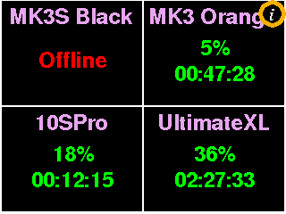
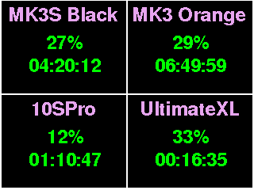

**Actions**:

* Pressing in any printer area will navigate to the [Printer Detail Screen](#printer-detail-screen) for that printer if the printer is actually printing. If not, a press will not cause any action.
* A long press anywhere on the screen navigates back to the [Home Screen](#home-screen).

### Printer Detail Screen

The Printer Detail Screen provides more detail about a print in progress. This screen is only available for printers that are either printing or have completed a print. The layout of the screen is:

* The nickname of the printer. If no nickname was specified, the server name will be used.
* The name of the file being printed. If the name ends with ".gcode", that will be stripped to preserve space. If the name won't fit on a single line, it will occupy two lines - but not more than that.
* A progress bar shows the percent completion of the print and the time remaining in HH:MM:SS format.
* The line below the progress bar gives the bed actual and target temperatures as well as the target and actual temperature for tool 1 (labeled E0 for extruder 0). Each pair is given as Actual / Target (e.g. 60.1 / 60.0). These values are always in degrees Celsius.
* The next line shows the elapsed time of the print (labeled as "Done:") and the estimated completion time (labeled "Est:"). When a print is complete, this will show "Complete" rather than an estimate.

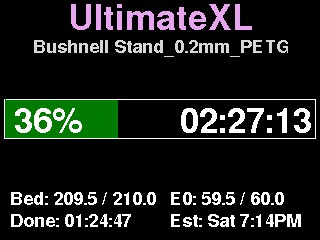
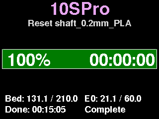

**Actions**:

* Pressing anywhere on the screen navigates back to the [Home Screen](#home-screen).
* If the print is complete (100%), it will continue to show as 100%, here and on the home screen, until an action is taken.
	* Sometimes it is preferable to show the printer as Online and ready for a new print. I sometimes use this distinction to remind myself whether I have already collected the last print so the printer is ready for a new job.
	* To get into this state, long press anywhere on the screen. That will navigate to the [Home Screen](#home-screen) and set the print to show as Online rather than 100% complete.
	* The screen shots below show the home screen showing "100%" (as it would before a long press here) and "Online" as it would after a long press here.

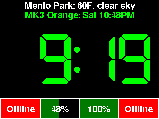
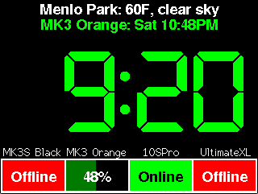

### Weather Screen

The weather screen shows current weather information form [OpenWeatherMap.org](http://OpenWeatherMap.org) for the city that was configured using the Web UI. In particular it shows:

* The name of the City in the upper left corner
* The current time in the upper right corner
* An icon giving a visual representation of the current weather conditions
* The current temperature 
* An icon giving a feel for wind speed (none, light, heavy)
* A textual description of the current weather condition
* The humidity, barometric pressure, visibility, and "real feel" temperature.

The units (metric or imperial) are configured in the Web UI.

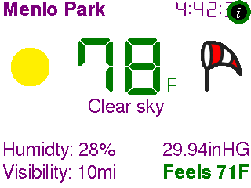  
*Note*: This shot shows the info icon in the upper right corner. It is occluding the seconds area of the time display.

**Actions**:

* Pressing anywhere on the screen navigates to the [Forecast](#forecast-screen).
* A long press anywhere on the screen navigates back to the [Home Screen](#home-screen).

### Forecast Screen

The Forecast Screen uses [OpenWeatherMap.org](http://OpenWeatherMap.org) to get the forecast for the city that was configured using the Web UI. The screen displays 6 forecasts arranged in two columns. It starts with the forecast for the next 3 hours. After that it presents the 5-day day forecast. They are ordered from top top bottom, left to right.

Each cell shows an icon representing the weather condition (e.g. Sunny or Rain), the low/high temperature, and the day / hour when the high will occur. Since the first forecast is just for a single 3 hour period, it only shows the average temperature (not high and low).

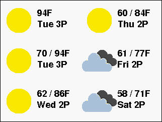

**Actions**:

* Pressing anywhere on the screen navigates back to the [Home Screen](#home-screen).
* A long press anywhere on the screen navigates back to the [Weather Screen](#weather-screen).

### Info Screen

The Info Screen displays various low level pieces of information also provides a few buttons that allow the user to take actions. The layout of the screen is:

* The header line just shows the the MultiMon version number
* Below that is the name of the monitor and its current IP address. If you use a computer/phone/tablet that has Bonjour support, you can access MultiMon by typing the unit's name followed by ".local" into the address bar of your browser. In the example below, the name of this unit is "MyMonitor" so you could access it by entering `http://MyMonitor.local` into your browser.
* To the right of that are bars indicating the WiFi signal strength (0 to 4 bars).
* Next is the `Refresh` button. Pressing it will cause MultiMon to ask each printer for fresh status information. The Info Icon will flash on the screen while that is happening. 
* The next row of buttons allows you to change the brightness of the screen to Dim, Medium, or Bright. The brightness can also be changed from the Web UI interactively or via a schedule. The current brightness level is displayed below the buttons.
* Finally, there are statistics about how much memory MultiMon is using. This is only of interest to developers.

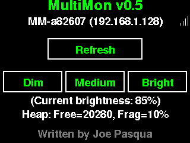

**Actions**:

* Pressing any of the buttons causes the actions described above (refreshing printer data or setting the brightness)
* Pressing anywhere else on the screen navigates back to the [Home Screen](#home-screen).
* A long press anywhere else on the screen navigates to the [Calibration Screen](#calibration-screen)

### Config Screen

This screen is only displayed when MultiMon can't connect to the WiFi network. This can happen for a new installation, or if the unit is moved to a new location with a different WiFi base station, or if the name or credentials for your base station have changed. In any of these circumstances, MultiMon will become a WiFi base station and display the Config Screen which will show its name (SSID). At that point you need to use your phone, tablet, or computer to connect to this WiFi base station and then select your normal WiFi base station and enter your password.

In the image shown below, you would connect your phone/tablet/computer to the WiFi station named "MM-a82607". The rest of the configuration happens on your phone/tablet/computer. Once the MultiMon unit is properly configured, it will reboot and connect to the network you specified.

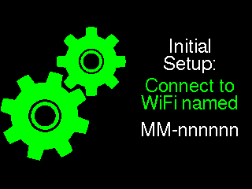

**Actions**:

* There are no additional actions available to the user from this screen.

### Calibration Screen

The Calibration screen allows you to calibrate the touch hardware built into the display. You need never use this functionality unless you are either finding touch to be inaccurate *or* you have flipped the orientation of the display using the Web UI.

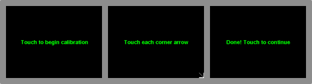  

**Actions**:
You will be presented with a screen that asks you to touch the screen to begin the calibration process. Once you do, you will be presented with a series of four screens. Each will display an arrow pointing to one corner of the display and asking you to touch that corner. Do so. Once you've done that, it will ask you to touch the screen again to complete the calibration process. At that point you will be taken back to the [Home Screen](#home-screen).

### Reboot Screen

An advanced user of the Web UI can request a reboot of the device. When they do so, the Reboot Screen will appear regardless of the current state of the GUI.

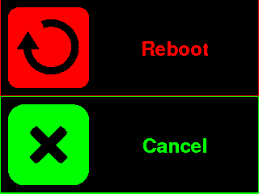

**Actions**:

* A long press of the `Reboot` button will cause the device to reboot. A normal press will be ignored.
* Pressing the `Cancel` button will navigate back to the [Home Screen](#home-screen). In a future release, pressing `Cancel` may go back to the previously displayed screen rather than the Time Screen.
* If you take no action for one minute, it is the same as pressing the `Cancel` button.