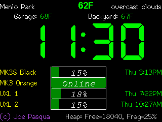

# MultiMon Plugin Guide


## Introduction

*MultiMon* contains the beginning of a Plugin system which supports expansion and customization in a no-code or low-code manner. Without any code a plugin can add a new screen to the GUI which presents existing information (e.g. temperature or printer status) information in a custom layout. With code, plugins may also add new data sources (e.g. readings from a locally attached sensor or data gathered from a REST API). For example, you may want a screen that contains a specific set of information in a specific layout that suits your needs. *MultiMon* ships with a couple of example plugins that you can use to help create your own.

Plugins are largely declarative, using JSON files to describe the GUI they present on the attached display, their settings, the Web form to display/edit the settings, and references to the data they consume. 

You can have many instances of the same type of plugin or of different types of plugin. At the moment, *MultiMon* allows up to four plugins but this is a somewhat arbitrary limit. More could be added if memory allows.

***NOTE***: This document is just as nascent as the Plugin system itself. Looking at the examples will be required to understand the mechanism.

## Structure of Plugins

A plugin consists of a number of JSON descriptors described below, and optionally C++ code for any deeper customizations. To create a no-code plugin (called a Generic plugin), only the JSON files are needed.

<a name="descriptors"></a>
### JSON Descriptors

Each plugin requires 4 JSON descriptors. All descriptors for a plugin are placed in a subdirectory of `/data/plugins` which can have any name you'd like. The directory name is not germane to the plugin. The four JSON files are listed below and must have these names:

* **plugin.json**: A simple file which gives the display name of the plugin and its type. The type must either be "generic" for no-code plugins, or must correspond to a name you've given in custom code.
* **settings.json**: If the plugin has settings, for example an API key for a REST service it uses, they are given in this file. This is very much like the main *MultiMon* settings file, but the contents are up to the plugin developer. For generic (no-code) plugins, there are just a few settings:
	* Whether the plugin is enabled
	* How often to refresh the UI
	* A representation of the units of the refresh interval (i.e. is it seconds, minutes, etc.)
* **form.json**: A [jsonform](https://github.com/jsonform/jsonform) descriptor that is used by the Web UI to allow the user to display and edit the settings. Using this mechanism, a plugin can augment *MultiMon*'s Web UI without creating a new HTML template or writing custom code.
* **screen.json**: A description of the layout and content of the screen. The FlexScreen class is responsible for parsing this description and displaying information - no custom code is required. FlexScreen can display things like floats, ints, and string using a format you specify. It can also display more complex things like a clock that automatically updates itself.

### Custom Code

You can create a plugin that goes beyond what is possible via a generic plugin. There are two types of code that may be involved in a custom plugin: the plugin itself and one or more data sources:

* **The plugin code**: The plugin code is a subclass of the built-in Plugin class. It is typically fairly simple and is responsible for a few things:
  * Serializing and Deserializing any custom settings from the settings.json file. This is fairly mechanical and can be copied and customized from one of the example plugins.
  * Mapping names to values. When you are describing your screen layout in the screen.json file, each field has a key. That key is a string that names the data value to be displayed. It is up to the plugin code to handle requests to map keys to actual values. For example, a key might be "headline" and the plugin might map that to a value from a news source which provides top headlines.
* **Data sources**: A data source is any code that makes data available for use by one or more plugins. This could be something that reads information from local sensors, a remote device, a news service - whatever. It is responsible for getting the data and providing an API for consuming it.

Plugin code should be placed in the `src/plugins` directory and the data sources should be placed  in the `src/clients` directory.

## Describing the GUI Layout

A major part of the plugin is the screen it displays in the GUI. This is defined in the `screen.json` file. The overall structure is:

````
{
  "items": [ { }, ... { } ],
  "bkg": "0x000000",
  "name": "Displayed Name"
}
````
The bulk of the content is in the `items` array, each element of which describes an item that is displayed on the screen. I sometimes refer to this as a field. An item may be static content, like a label, or it may be a reference to some value. Before going into the details of items, there are two other simple elements:

* `bkg`: Provide the background color of the screen as a 24bit hex color code
* `name`: The name that will be used to identify the plugin in the GUI and Web UI. This should be a fairly short name as space is limited in the GUI.

The `items` have a number of elements, some of which are optional:

````
{
  "x": 86,  "y": 35,
  "w": 117,  "h": 26,
  "xOff": 58, "yOff": 13,
  "justify": "MC",
  "font": "SB9",
  "color": "0xFFFFFF",
  "format": "%s",
  "strokeWidth": 2
  "type": "STRING",
  "key": "stress"
}
````

The elements are as follows:

* `x, y, w, h`: *Required*. These provide the size and location of the field on the display. The location (0, 0) represents the upper left corner of the display. Note that displayed values are not clipped to the bounding box defined by `w, h`. 
* `xOff, yOff	`: *Optional*. Gives the offset within the bounding box where the content will be rendered. If not specified, it will default to (0, 0).
* `justify`: *Optional*. Defines the alignment of the displayed content within the field. For example, if you would like the content to be centered horizontally and vertical within the field's bounding box, then set `(xOff, yOff)` to `(width/2, height/2)` and use `MC` as the `justify` value.
  
  Allowed values are:
  * TL: Top Left
  * TC: Top Center
  * TR: Top Right
  * ML: Middle Left
  * MC: Middle Center
  * MR: Middle Left
  * BL: Bottom Left
  * BC: Bottom Center
  * BR: Bottom Right

  If not specified, it will default to `TL`. 
* `font`: *Optional*. The font to be used. The structure of the names are: `Family` `Style` `Size`. The families are Mono (M), SansSerif (S), Digital (D). The styles are Regular (default), Bold (B), Oblique (O), and Bold-Oblique (BO). The allowed values are:
  * M9, MB9, MO9, MBO9: 9 point Mono fonts in all styles
  * S9, SB9, SO9, SBO9: point Sans fonts in all styles
  * S12, SB12, SO12, SBO12: 12 point Sans fonts in all styles
  * S18, SB18, SO18, SBO18: 18 point Sans fonts in all styles
  * S24, SB24, SO24, SBO24: 24 point Sans fonts in all styles
  * D20, D72, D100: 7-Segment Digital Font in large sizes

* `color`: *Required*. The color of the content of the field. This is a 24-bit (888) hex color specifier (not a name) which may begin with `#` or `0x`.
* `format`: *Optional*. The format is used to display the content of the field. It is a `printf` style format. For example if the field is meant to display a temperature, then the format might be: `"Temp: %0.1fF"`. If the field is just a static label, then the format specifies the label. Note: while optional, if this is not supplied, then no content will be displayed other than a border if specified. 
* `strokeWidth`: *Optional*. If supplied it specifies the size of a border to be drawn around (inside of) the bounding box. If not supplied, then no border will be drawn.
* `type`: *Optional*. Specifies the type of the value to be displayed in the field. Allowed values are: `INT`, `FLOAT`,  `STRING`, `BOOL`, and `CLOCK`. `CLOCK` is a special value which substitutes the current time.
  
  The `type` must correspond to the `format`. For example, if the `type` is `FLOAT`, then the `format` must include some variation of `%f`.
* `key`: The name of a data value that should be supplied by the Plugin framework when the screen is displayed. Allowed values are defined by the custom Plugin code ***or*** a system value may be used (see [below]()). For example, a custom Plugin that reads sensor data might have a value called "stress". This name may be used as a key.

<a name="sysvalues"></a>
## System Values

Any plugin (generic or custom) may access values made available by an app-wide data broker. The values are grouped by type; for example, system values, printer values, and weather values. Each group has a unique prefix starting with '$'. The list of available values are given in the table below.


| Full name | Type 	  | Description	|
|-----------|:-------:|------------	|
| **System**    |         |	             |
| `$S.author` | STRING  | MultiMon's author                 |
| `$S.heap`   | STRING  | Heap free space and fragmentation |
| **Weather**   |   | |
| `$W.temp`   | FLOAT   | Current temperature |
| `$W.desc`   | STRING  | Short description of weather conditions  |
| `$W.ldesc`  | STRING  | Longer description of weather conditions |
| **Printers**   |   | |
| `$P.next`  | STRING | A composite string giving the name of the printer that will complete a job next and the time at which it will be complete|             	|

## The Blynk Weather Plugin Example

The Blynk Weather Plugin is an example of a custom plugin that provides a new data source and custom plugin code. The new data source is for the [Blynk](https://blynk.io) service. In this example a weather station such as [JAWS](https://github.com/jpasqua/JAWS) writes readings like temperature and humidity to the Blynk service. The Blynk Weather plugin collects data from up to two weather stations and displays the information in a new screen:


This plugin consists of a number of files:

* `src/clients/BlynkClient.[cpp,h]`: The client code that reads data from the Blynk service that was written there by a weather station. Though BlynkClient is used by the BlynkWeather plugin, it can also be used by any plugin that wants to read arbitrary information from Blynk.
* `src/plugins/BlynkPlugin.[cpp,h]`: The custom plugin code that manages settings and maps names to values. 
* `data/plugins/blynk1/*.json`: The JSON plugin descriptors as [described above](#descriptors).

This plugin has a number of settings that need to be specified by the user such as the Blynk IDs associated with the two weather stations and nicknames for each station that will be displayed in the GUI. The `form.json` file describes the web form that will be used to present the settings to the user. [jsonform](https://github.com/jsonform/jsonform) is a very rich tool that is well described on github. Please refer to its [wiki](https://github.com/jsonform/jsonform/wiki) to learn more.

To use this plugin you would have to have a data publisher (a weather system) that publishes data out to Blynk. However, it should be easily adapted to other sensor data that is available through that service.

## The Generic Plugin Example

The generic plugin example shows how to create a custom screen with your own layout that displays existing data from the [system](#sysvalues). In this case, there is no code - just the JSON descriptor files.



Some things to notice in the descriptor files:

* **plugin.json**:
  * The name specified here is the display name. It gets used in the [Utility screen](MultiMonGUI.md/#utility-screen) to label a button and the [plugin settings page](../Readme.md#configure-plugins) in the Web UI.
  * The type is "generic" which tells the system that this is a generic plugin rather than one that requires custom code.
* **screen.json**: The screen layout has examples of left, right, and center-justifying fields. It uses different fonts, different sizes, and different colors. It pulls data from the system namespace, the printer namespace, and the weather namespace. it also uses the `CLOCK` type which is likely to be subsumed into a more general mechanism for multi-part values over time.
* **settings.json**: Generic plugins have four elements in their settings file. Only two are visible to the user:
  * `version`: *Not user visible*. This is the version of the settings structure. It is used internally by the system.
  * `enabled`: *User visible*. Is the plugin enabled? That is, will the user be able to select this plugin in the GUI. 
  * `refreshInterval`: *User visible*. How often the GUI should be updated.
  * `riScale`: *Not User Visible*. The units of `refreshInterval`. Internally all refresh times are represented in milliseconds. If you want the user to operate in seconds, then `riScale` should be 1000 (1000 millis in a second). If you want the user to set values in minutes, then `riScale` should be 60*1000.
* **form.json**: This file describes how the settings should be displayed to the user in the Web UI. A couple of points of interest here:
  * The version setting is not listed at all since it is not sent from the browser to *MultiMon*.
  * The `riScale` field is sent to the server, but the user doesn't see it, so it is declared as hidden.
